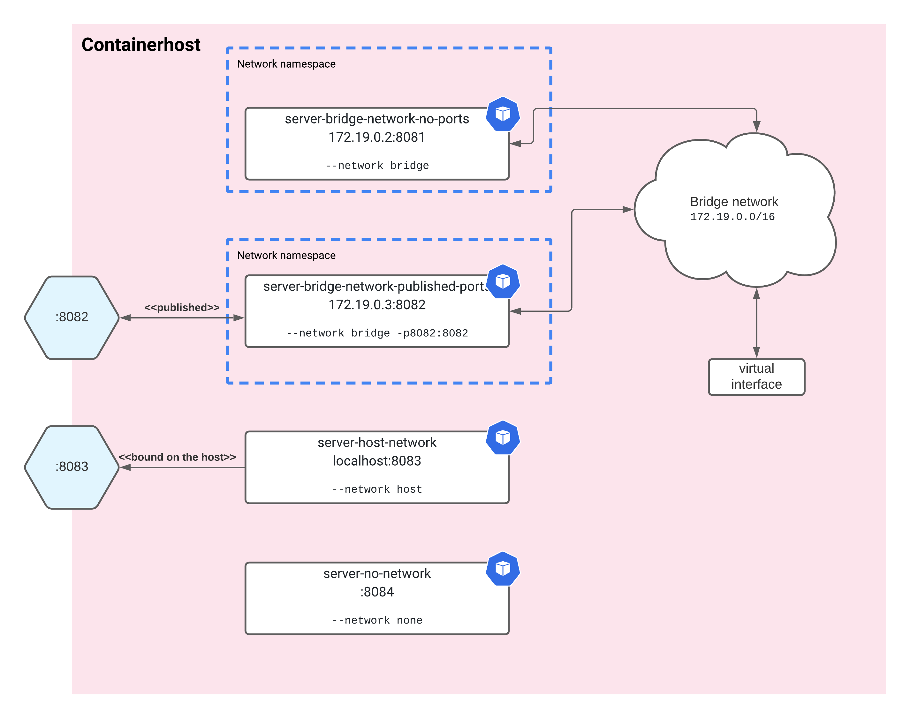

Companion repo to https://kupczynski.info/2021/03/22/fun-with-docker-networks.html

# Fun with docker networks

In this post I research how various docker network options work.

We run 4 containers with different settings:


## Host

You can follow along on any linux machine. I run the commands on ubuntu 20.04 on vagrant on VirtualBox.

If you're on macOS and want to have the same environment run:

```sh
# Install VirtualBox
# .. left as an excercise for the reader


# Install vagrant
brew bundle

# Power up the box
vagrant up

# SSH to the box
vagrant ssh
```

You can carry on on the shell session to the vagrant box.

Don't forget to power down everything at the end:
```sh
vagrant halt
```

## Create the docker containers

Check their definitions in [docker-compose.yaml](src/docker-compose.yaml).

```sh
$ cd ~src
$ docker-compose up
..
server-bridge-network-no-ports           | 2021/03/20 23:04:32 Listening on :8081
server-bridge-network-published-ports    | 2021/03/20 23:04:32 Listening on :8082
server-host-network                      | 2021/03/20 23:04:32 Listening on :8083
server-no-network                        | 2021/03/20 23:04:32 Listening on :8084
```

## Various types of container networks

```sh
$ docker ps -a
CONTAINER ID   IMAGE                                    COMMAND                  CREATED         STATUS         PORTS                    NAMES
a0e3ace002ac   ghcr.io/igor-kupczynski/netutil:latest   "/app/netutil-serve …"   8 minutes ago   Up 8 minutes                            server-no-network
ee9448cdcb86   ghcr.io/igor-kupczynski/netutil:latest   "/app/netutil-serve …"   9 minutes ago   Up 8 minutes                            server-bridge-network-no-ports
61dad5eb2c47   ghcr.io/igor-kupczynski/netutil:latest   "/app/netutil-serve …"   9 minutes ago   Up 8 minutes                            server-host-network
d688eabec6a5   ghcr.io/igor-kupczynski/netutil:latest   "/app/netutil-serve …"   9 minutes ago   Up 8 minutes   0.0.0.0:8082->8082/tcp   server-bridge-network-published-ports
```


### Try to reach the containers on the host address, from the host

```sh
for p in 8081 8082 8083 8084
	do ADDR="localhost:$p"
	curl -s "$ADDR/quote" -o /dev/null && echo "[ OK ] Connected to $ADDR" || echo "[FAIL] Can't connect to $ADDR"
done
```

```
[FAIL] Can't connect to localhost:8081
[ OK ] Connected to localhost:8082        # host forwards its :8082 to contianer :8082
[ OK ] Connected to localhost:8083        # it shares the network with the host
[FAIL] Can't connect to localhost:8084
```

### Find out the network the containers are on and their IPs

```sh
for c in `docker ps -a -q`
	do docker inspect -f '{{.Name}}: {{range.NetworkSettings.Networks}}{{.IPAddress}}/{{.IPPrefixLen}}{{end}}' $c
done
```

Note that the IPs or the order maybe different
```
/server-bridge-network-no-ports: 172.19.0.2/16
/server-no-network: /0									# we've run it with --network none, expected
/server-bridge-network-published-ports: 172.19.0.3/16
/server-host-network: /0                                # it's part of the host network, so 127.0.0.1
```

How does the magic happen? With [network namespaces](https://www.man7.org/linux/man-pages/man7/network_namespaces.7.html).

> Network namespaces provide isolation of the system resources associated with networking 
> ...
> A virtual network (veth(4)) device pair provides a pipe-like abstraction that can be used to create tunnels between network namespaces, and can be used to create a bridge to a physical network device in another namespace.


We can list the network namespaces with:
```sh
sudo ip netns ls
```

```
d90c654fcd64 (id: 1)
6f22a7d95093 (id: 0)
6b660431938c
default
```

If the list is empty, try the following:
```sh
sudo rmdir /var/run/netns
sudo ln -s /var/run/docker/netns  /var/run/netns
```

Docker mounts the network namespaces under a different directory, where `ip netns` doesn't expect them. [Learn more](https://stackoverflow.com/questions/31265993/docker-networking-namespace-not-visible-in-ip-netns-list).

### Try to reach the containers on their IP addresses, from the host

```sh
TO_CHECK=( "172.19.0.2:8081" "172.19.0.3:8082" )
for ADDR in "${TO_CHECK[@]}"
	do curl -s "$ADDR/quote" -o /dev/null && echo "[ OK ] Connected to $ADDR" || echo "[FAIL] Can't connect to $ADDR"
done
```

```
[ OK ] Connected to 172.19.0.2:8081  # this works regardless of the port forwarding
[ OK ] Connected to 172.19.0.3:8082
```

As we see here the port forwarding only affects the host network, the containers have their ports accessible on their IP addresses.

How does the host know how to reach the container IPs?

```sh
$ ip route
default via 10.0.2.2 dev enp0s3 proto dhcp src 10.0.2.15 metric 100
10.0.2.0/24 dev enp0s3 proto kernel scope link src 10.0.2.15
10.0.2.2 dev enp0s3 proto dhcp scope link src 10.0.2.15 metric 100
172.17.0.0/16 dev docker0 proto kernel scope link src 172.17.0.1 linkdown
172.19.0.0/16 dev br-a619154cdbef proto kernel scope link src 172.19.0.1
```

```sh
$ ip addr show dev br-a619154cdbef
3: br-a619154cdbef: <BROADCAST,MULTICAST,UP,LOWER_UP> mtu 1500 qdisc noqueue state UP group default
    link/ether 02:42:e0:d0:7c:b4 brd ff:ff:ff:ff:ff:ff
    inet 172.19.0.1/16 brd 172.19.255.255 scope global br-a619154cdbef
       valid_lft forever preferred_lft forever
    inet6 fe80::42:e0ff:fed0:7cb4/64 scope link
       valid_lft forever preferred_lft forever
```

To reach `172.19.0.0/16` the host uses virtual interface `br-a619154cdbef` with IP `172.19.0.1`.

This virtual interface is actually a virtual switch, or a [bridge](https://wiki.archlinux.org/index.php/Network_bridge):
>  bridge is a piece of software used to unite two or more network segments. A bridge behaves like a virtual network switch, working transparently (the other machines do not need to know about its existence). Any real devices (e.g. eth0) and virtual devices (e.g. tap0) can be connected to it.


We can see devices connected to it:
```sh
$ bridge link | grep br-a619154cdbef
14: veth2fd9074@if13: <BROADCAST,MULTICAST,UP,LOWER_UP> mtu 1500 master br-a619154cdbef state forwarding priority 32 cost 2
16: veth0aa1aa4@if15: <BROADCAST,MULTICAST,UP,LOWER_UP> mtu 1500 master br-a619154cdbef state forwarding priority 32 cost 2
```

And what's the other side of these devices?
- `14: veth2fd9074@if13` -- device `14` named `veth2fd9074` is paired with device `13`.
- `13` is likely in a different network namespace.

Indeed:
```sh
$ sudo ip -n d90c654fcd64 addr
..
13: eth0@if14: <BROADCAST,MULTICAST,UP,LOWER_UP> mtu 1500 qdisc noqueue state UP group default
    link/ether 02:42:ac:13:00:02 brd ff:ff:ff:ff:ff:ff link-netns default
    inet 172.19.0.2/16 brd 172.19.255.255 scope global eth0
       valid_lft forever preferred_lft forever
```

We can also map the containers to their network namespaces:
```sh
for c in `docker ps -a -q`
  do docker inspect -f '{{.Name}}:    {{.NetworkSettings.SandboxKey}}' $c
done
```

```
/server-bridge-network-no-ports:    /var/run/docker/netns/d90c654fcd64
/server-no-network:    /var/run/docker/netns/6b660431938c
/server-bridge-network-published-ports:    /var/run/docker/netns/6f22a7d95093
/server-host-network:    /var/run/docker/netns/default
```

In this case we now that `13-14` pair connects `server-bridge-network-no-ports` namespace with the `br-a619154cdbef` bridge.


Docker compose creates one such a bridge per _project_.


### Connection between the containers

The containers on the same bridge network `172.19.0.0/16`:

```sh
$ docker exec -ti server-bridge-network-published-ports curl -s "172.19.0.2:8081/quote" -o /dev/null && echo "[ OK ] Connected to 172.19.0.2:8081" || echo "[FAIL] Can't connect to 172.19.0.2:8081"
[ OK ] Connected to 172.19.0.2:8081
```

```sh
$ docker exec -ti server-bridge-network-no-ports curl -s "172.19.0.3:8082/quote" -o /dev/null && echo "[ OK ] Connected to 172.19.0.3:8082" || echo "[FAIL] Can't connect to 172.19.0.3:8082"
[ OK ] Connected to 172.19.0.3:8082
```

### Access the host from within the containers

This is easy for the `server-host-network` as it is a part of the host network:
```sh
# Note :8082 is the port forwarded to the other container
$ docker exec -ti server-host-network curl -s "localhost:8082/quote" -o /dev/null && echo "[ OK ] Connected to localhost:8082" || echo "[FAIL] Can't connect to localhost:8082"
[ OK ] Connected to localhost:8082
```

It is also possible from the bridge network containers.

Let's open a shell in one of the containers and check:
```sh
$ docker exec -ti server-bridge-network-no-ports bash
```

Let's check the default gateway in the container:
```sh
ip route
```
```
default via 172.19.0.1 dev eth0                                # 172.19.0.1 is the container host
172.19.0.0/16 dev eth0 proto kernel scope link src 172.19.0.2
```

And let's use it to connect to various ports:
```sh
for p in 8081 8082 8083 8084
	do ADDR="172.19.0.1:$p"
	curl -s "$ADDR/quote" -o /dev/null && echo "[ OK ] Connected to $ADDR" || echo "[FAIL] Can't connect to $ADDR"
done
```

Indeed, the result is the same as from the host:
```
[FAIL] Can't connect to 172.19.0.1:8081
[ OK ] Connected to 172.19.0.1:8082
[ OK ] Connected to 172.19.0.1:8083
[FAIL] Can't connect to 172.19.0.1:8084
```

### No network

Well, no network doesn't have any network devices. It's up to you to create them in its network namespace and connect them to the other networks.

Only loopback:
```sh
$ docker exec -ti server-no-network ip link
1: lo: <LOOPBACK,UP,LOWER_UP> mtu 65536 qdisc noqueue state UNKNOWN mode DEFAULT group default qlen 1000
    link/loopback 00:00:00:00:00:00 brd 00:00:00:00:00:00
```

## Summary

Host can access:
1. Ports on the `--network host` containers via `localhost:<container-port>`.
2. Published ports on the `--network bridge` containers. A port is published `-p<host-port>:<container-port>` then it is accessible via `localhost:<host-port>`.
3. Not published ports on `--network bridge` containers via `<container-ip-address>:<container-port>`

For host mode containers (`--network host`) it is the same as for the host.

Bridge network containers can access:
1. Ports on other containers in the same bridge network via `<container-ip>:<container-port>`.
2. Ports on the host (or host-mode containers) via `<host-ip-in-the-bridge-network>:<host-port>` (and you can find the host ip by looking at the default gateway).

### TODO / future work:
- How does the port publishing work?
- Bridge network containers can access the public internet. How does it work?
